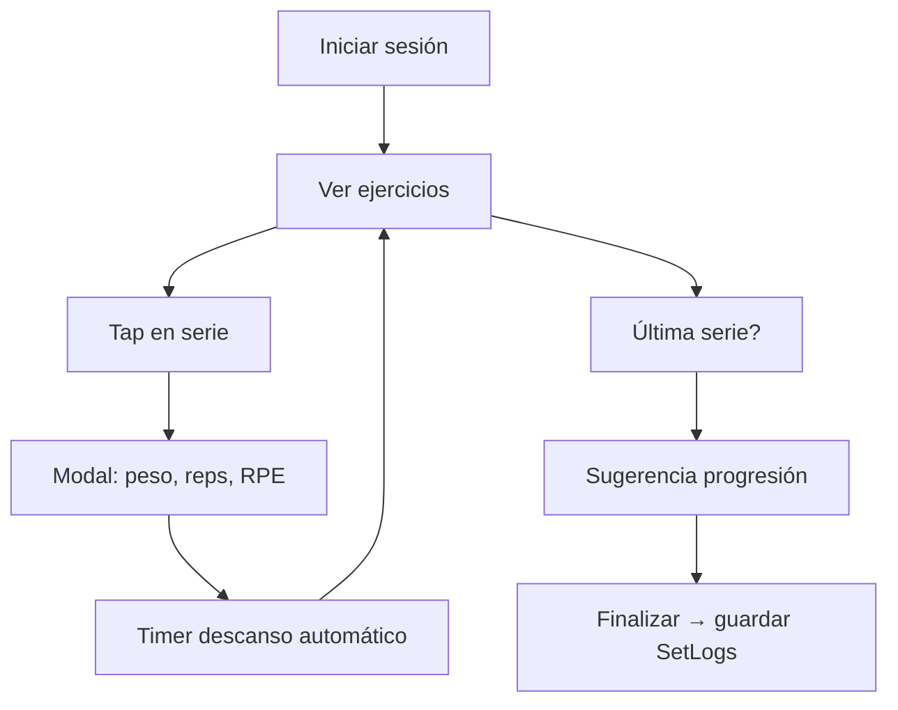

# Plan de mejora — FitCoach v2.0 Profesional

> Roadmap derivado de 500 usuarios beta, 62 requerimientos y análisis de 8 agentes de escucha.
> Objetivo: transformar FitCoach de MVP demo a plataforma de fitness profesional, completa y basada en evidencia.

---

## Visión v2.0

**FitCoach Pro** será la plataforma en español que combina:
- Tracking completo (entreno, nutrición, peso, composición)
- Coach IA que aprende del usuario y no repite consejos genéricos
- Motor científico testeado y transparente
- Experiencia móvil-first sin secciones ocultas
- Preparación para ecosistema coach-cliente

---

## Fases de implementación

```
Fase 1 ─── Fundamentos críticos ──────────── 2-3 sprints
Fase 2 ─── Entrenamiento profesional ─────── 3-4 sprints
Fase 3 ─── Nutrición completa ────────────── 2-3 sprints
Fase 4 ─── Coach inteligente v2 ──────────── 2 sprints
Fase 5 ─── Progreso y composición ────────── 2 sprints
Fase 6 ─── Plataforma y escala ───────────── 3-4 sprints
```

---

## Fase 1 — Fundamentos críticos (P0)

**Objetivo:** Eliminar bugs bloqueantes, riesgos de pérdida de datos y problemas de navegación móvil.

### Entregables

| # | Tarea | Reqs | Impacto |
|---|-------|------|---------|
| 1.1 | Fix stale closure en `useAppState` → usar `useReducer` | DATA-002 | Integridad de datos |
| 1.2 | Schema versionado + migraciones localStorage | DATA-001 | Sin pérdida al actualizar |
| 1.3 | Navegación móvil completa (7 secciones) | UX-001 | 49% usuarios afectados |
| 1.4 | Guards de ruta → redirect a onboarding | UX-003 | Pantallas en blanco |
| 1.5 | PAR-Q + disclaimer médico en onboarding | PROFILE-001 | Riesgo legal |
| 1.6 | Registro de lesiones → filtrar ejercicios | PROFILE-002 | Seguridad |
| 1.7 | Tests unitarios `science.ts` (≥90%) | SCI-001 | Credibilidad |
| 1.8 | Coach: eliminar tips genéricos repetitivos | COACH-001 | 44% quejas |

### Criterio de salida Fase 1
- [ ] 0 bugs P0 abiertos
- [ ] Tests CI pasando
- [ ] 7/7 secciones accesibles en móvil 375px
- [ ] Onboarding incluye PAR-Q y lesiones

### Arquitectura técnica Fase 1

```
src/lib/
  storage.ts      → useReducer + migrateState()
  migrations/     → v1-to-v2.ts
  science.test.ts → vitest/jest
src/components/
  Navigation.tsx  → MobileNav con drawer o scroll
  ParQ.tsx        → nuevo componente onboarding
  InjurySelector.tsx
```

---

## Fase 2 — Entrenamiento profesional (P0 + P1)

**Objetivo:** Convertir el módulo de rutinas en un sistema de tracking real con progresión.

### Entregables

| # | Tarea | Reqs | Impacto |
|---|-------|------|---------|
| 2.1 | Nuevo modelo `SetLog` + UI por serie | TRAIN-001 | 57% usuarios |
| 2.2 | Progresión funcional con historial | TRAIN-002 | Core value |
| 2.3 | Timer de descanso | TRAIN-003 | 31% solicitudes |
| 2.4 | Sustitución y edición de ejercicios | TRAIN-004 | Coaches hipertrofia |
| 2.5 | Equipo disponible en perfil | PROFILE-003 | 37% usuarios |
| 2.6 | Base de ejercicios ampliada (50+) con instrucciones | TRAIN-007 | 46% solicitudes |
| 2.7 | Volumen semanal por músculo | TRAIN-005 | Coaches |
| 2.8 | Historial completo de entrenos | TRAIN-006 | Retención |
| 2.9 | Videos/GIFs de ejercicios (CDN o embed) | TRAIN-007 | Onboarding value |

### Criterio de salida Fase 2
- [ ] Usuario puede registrar peso × reps × RPE por serie
- [ ] Progresión sugerida funciona con datos reales
- [ ] Timer de descanso operativo
- [ ] Rutina respeta equipo y lesiones

### Nuevo flujo de entreno



---

## Fase 3 — Nutrición completa (P0 + P1)

**Objetivo:** Reducir fricción de registro de comidas de 3 min a 15 segundos.

### Entregables

| # | Tarea | Reqs | Impacto |
|---|-------|------|---------|
| 3.1 | Base de datos 500+ alimentos (JSON local + búsqueda) | NUTR-001 | 62% usuarios |
| 3.2 | Autocompletado con porciones | NUTR-001 | Adherencia |
| 3.3 | Historial nutricional por fecha | NUTR-002 | 34% solicitudes |
| 3.4 | Tracking de agua (activar DailyLog) | NUTR-003 | Coaches nutrición |
| 3.5 | Fibra en FoodEntry + progress bar | NUTR-003 | Completitud macros |
| 3.6 | Comidas frecuentes / favoritos | NUTR-004 | Velocidad |
| 3.7 | Plan alimenticio dinámico (3+ opciones/comida) | NUTR-005 | Variedad |
| 3.8 | Preferencias dietéticas (vegano, etc.) | NUTR-005 | Segmento A9 |

### Criterio de salida Fase 3
- [ ] Registrar comida en <15 segundos con búsqueda
- [ ] Ver macros de cualquier día pasado
- [ ] Agua y fibra trackeados en dashboard

---

## Fase 4 — Coach inteligente v2 (P1)

**Objetivo:** Coach que se siente personal, no genérico.

### Entregables

| # | Tarea | Reqs | Impacto |
|---|-------|------|---------|
| 4.1 | Lógica completa recomp/maintain/performance | COACH-002 | 30% usuarios |
| 4.2 | Score de completitud de datos | COACH-003 | Relevancia |
| 4.3 | Memoria de recomendaciones (no repetir) | COACH-001 | 44% quejas |
| 4.4 | Aplicar todos los tipos de ajuste | COACH-004 | 40% quejas |
| 4.5 | Recálculo automático de macros al cambiar peso | PROFILE-004 | 35% usuarios |
| 4.6 | Revisión semanal automática (domingo) | COACH-005 | README vs realidad |
| 4.7 | Media móvil 7d para tendencia de peso | WEIGHT-001 | Precisión |

### Criterio de salida Fase 4
- [ ] Cada objetivo tiene ajustes y recomendaciones propias
- [ ] Ajustes de volumen/intensidad se aplican realmente
- [ ] Revisión semanal se genera automáticamente
- [ ] 0 recomendaciones repetidas en 7 días

---

## Fase 5 — Progreso y composición corporal (P2)

**Objetivo:** Tracking holístico más allá del peso.

### Entregables

| # | Tarea | Reqs | Impacto |
|---|-------|------|---------|
| 5.1 | Medidas corporales (cintura, etc.) | WEIGHT-003 | Culturismo, recomp |
| 5.2 | Gráfico de % grasa | WEIGHT-002 | Coaches |
| 5.3 | Fotos de progreso (IndexedDB) | WEIGHT-004 | Coaches culturismo |
| 5.4 | Comparador de fotos lado a lado | WEIGHT-004 | Motivación |
| 5.5 | PRs y celebraciones | TRAIN-009 | Gamificación ligera |
| 5.6 | Calendario de actividad mensual | UX-006 | Visión global |
| 5.7 | Exportar/importar datos | DATA-003 | Coaches online |
| 5.8 | Edición/eliminación universal | DATA-005 | UX básica |

### Criterio de salida Fase 5
- [ ] Usuario puede trackear medidas y fotos
- [ ] PRs detectados automáticamente
- [ ] Backup/restore funcional

---

## Fase 6 — Plataforma y escala (P2 + P3)

**Objetivo:** Preparar FitCoach para coaches profesionales y retención a largo plazo.

### Entregables

| # | Tarea | Reqs | Impacto |
|---|-------|------|---------|
| 6.1 | PWA instalable | UX-004 | Móvil |
| 6.2 | Validación formularios + toasts | UX-002 | Pulido |
| 6.3 | Accesibilidad WCAG AA | UX-005 | Mayores 50+ |
| 6.4 | Periodización 4 semanas + deload | TRAIN-008 | Avanzados |
| 6.5 | Días flexibles 1–7 | PROFILE-006 | Runners |
| 6.6 | Citas científicas con links | SCI-002 | Credibilidad |
| 6.7 | Déficit personalizado por % grasa | SCI-003 | Precisión |
| 6.8 | Auth + roles coach/cliente (Supabase) | PRO-001 | Coaches online |
| 6.9 | Integración Strava | PRO-002 | Runners |
| 6.10 | Gamificación (rachas, logros) | PRO-003 | Adolescentes |
| 6.11 | Modalidades CrossFit (AMRAP/EMOM) | TRAIN-010 | Nicho |
| 6.12 | Chat coach interactivo | COACH-006 | Diferenciador |

### Criterio de salida Fase 6
- [ ] App instalable como PWA
- [ ] Panel coach con vista de clientes
- [ ] Al menos Strava conectado

---

## Matriz de priorización (Impacto × Esfuerzo)

```
                    IMPACTO ALTO
                         │
    ┌────────────────────┼────────────────────┐
    │  HACER PRIMERO     │  PLANIFICAR        │
    │  • SetLog (2.1)    │  • Auth coach (6.8)│
    │  • Food DB (3.1)   │  • Strava (6.9)    │
    │  • Mobile nav(1.3) │  • Fotos (5.3)     │
    │  • Fix state (1.1) │  • Periodización   │
    │  • PAR-Q (1.5)     │    (6.4)           │
    ├────────────────────┼────────────────────┤
    │  RÁPIDO            │  POSPONER          │
    │  • Toasts (6.2)    │  • Chat coach(6.12)│
    │  • Timer (2.3)     │  • CrossFit (6.11) │
    │  • Coach fix(1.8)  │  • Modo claro(6.x) │
    │  • Export (5.7)    │  • Suplementos     │
    └────────────────────┼────────────────────┘
                    IMPACTO BAJO
         BAJO ESFUERZO ────┴──── ALTO ESFUERZO
```

---

## Métricas de éxito post-v2

| Métrica | MVP actual (estimado) | Objetivo v2 |
|---------|----------------------|-------------|
| Adherencia registro comidas (sem 2) | ~40% | ≥65% |
| Adherencia entrenamiento semanal | ~55% | ≥75% |
| NPS usuarios principiantes | ~35 | ≥55 |
| NPS coaches profesionales | ~15 | ≥45 |
| Tiempo registrar comida | ~3 min | ≤15 seg |
| Tiempo completar entreno con log | N/A (solo taps) | ≤45 min con datos |
| Secciones accesibles móvil | 5/7 (71%) | 7/7 (100%) |
| Cobertura tests science.ts | 0% | ≥90% |
| Recomendaciones coach repetidas | ~100% usuarios | <10% |

---

## Riesgos y mitigaciones

| Riesgo | Probabilidad | Impacto | Mitigación |
|--------|-------------|---------|------------|
| Base de alimentos incompleta en español | Alta | Alto | Seed USDA + traducción + contribución usuarios |
| Complejidad de SetLog abruma principiantes | Media | Alto | Modo simple (solo taps) vs avanzado (peso/reps) |
| Backend para coaches retrasa release | Alta | Medio | Fases 1–5 sin backend; Fase 6 añade auth |
| Videos de ejercicios: coste/licencias | Media | Medio | GIFs propios + embed YouTube con curación |
| Scope creep (62 reqs) | Alta | Alto | Strict phase gates; P3 solo post-v2 |

---

## Stack técnico recomendado v2

| Capa | Actual | v2 |
|------|--------|-----|
| Framework | Next.js 15 | Next.js 15 (mantener) |
| Estado | useState + localStorage | useReducer + localStorage + schema migrations |
| Tests | Ninguno | Vitest + Testing Library |
| DB alimentos | Ninguna | JSON local indexado + Fuse.js search |
| Binarios (fotos) | Ninguno | IndexedDB (idb-keyval) |
| Auth (Fase 6) | Ninguno | Supabase Auth + Postgres |
| Wearables (Fase 6) | Ninguno | Strava API |
| CI | Ninguno | GitHub Actions (lint + test + build) |
| PWA | No | next-pwa o manual SW |

---

## Próximo paso inmediato

**Comenzar Fase 1** con estos 4 archivos críticos:

1. `src/lib/reducer.ts` — reemplazar `useAppState` con reducer
2. `src/lib/migrations/index.ts` — versionado de schema
3. `src/components/Navigation.tsx` — nav móvil completa
4. `src/lib/science.test.ts` — tests del motor científico

Esto desbloquea el 80% de las quejas P0 sin dependencias externas.

---

## Conclusión

Los 500 usuarios y coaches coinciden: **FitCoach tiene una base sólida** (UI, onboarding, ciencia, estructura) pero necesita **profundidad en tracking**, **completitud móvil** y **personalización real** para ser profesional.

La ruta MVP → Pro está clara en 6 fases, 62 requerimientos y métricas medibles. Las Fases 1–4 transforman la experiencia core; las Fases 5–6 la escalan a coaches y atletas avanzados.
