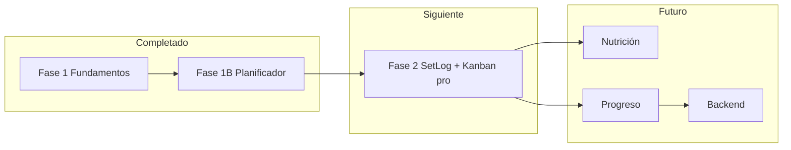

# Plan de mejora — Actualizado Jun 2026

> Post Ronda 2 · 500 usuarios · 68 requerimientos · Schema v3

---

## Progreso global

```
Fase 1  ████████████████████ 100%  ✅ COMPLETADA
Fase 1B ████████████████████ 100%  ✅ Planificador Kanban
Fase 2  ░░░░░░░░░░░░░░░░░░░░   0%  ⏳ Siguiente
Fase 3  ░░░░░░░░░░░░░░░░░░░░   0%
Fase 4  ████████░░░░░░░░░░░░  40%  🟡 Coach parcial
Fase 5  ██░░░░░░░░░░░░░░░░░░  10%
Fase 6  ░░░░░░░░░░░░░░░░░░░░   0%
```

---

## ✅ Fase 1 — Fundamentos (COMPLETADA)

| Tarea | Estado |
|-------|--------|
| useReducer + migraciones v2 | ✅ |
| Nav móvil 7/7 con drawer | ✅ |
| PAR-Q + lesiones + equipo | ✅ |
| Tests science.ts (13) | ✅ |
| Coach sin tips repetitivos | ✅ |
| RouteGuard | ✅ |
| Export JSON | ✅ |

---

## ✅ Fase 1B — Planificador semanal (COMPLETADA)

| Tarea | Estado |
|-------|--------|
| WeeklyPlan en AppState v3 | ✅ |
| Kanban 7 días drag-and-drop | ✅ |
| Paleta: pecho, espalda, push, pull, cardio, descanso... | ✅ |
| Plantillas: musculación, PPL, upper/lower | ✅ |
| syncRoutineFromPlan() | ✅ |
| Dashboard "hoy" según plan | ✅ |
| Tests schedule.ts (5) | ✅ |

**Ejemplo soportado (usuario real):**
```
Dom → Piernas | Lun → Pecho | Mar → Espalda | Mié → Piernas
Jue → Hombros | Vie → Descanso + Cardio | Sáb → Descanso + Cardio
```

---

## ⏳ Fase 2 — Entrenamiento + Planificador pro (SIGUIENTE)

**Objetivo:** Profundidad en tracking y pulir planificador según Ronda 2.

| # | Tarea | Req | Impacto |
|---|-------|-----|---------|
| 2.1 | SetLog: peso × reps × RPE por serie | TRAIN-001 | 54% |
| 2.2 | Progresión con historial real | TRAIN-002 | Core |
| 2.3 | Timer de descanso | TRAIN-003 | 31% |
| 2.4 | Tap-to-add en Kanban móvil | PLAN-001 | 38% |
| 2.5 | Banner "cambios sin guardar" + auto-save | PLAN-005 | 29% |
| 2.6 | Editar ejercicios por bloque del plan | PLAN-008 | 34% |
| 2.7 | Cardio trackeable (tiempo, distancia) | PLAN-011 | 42% |
| 2.8 | Duplicar día / copiar semana | PLAN-006 | 27% |
| 2.9 | Volumen semanal por músculo | PLAN-009 | 22% |

### Criterio de salida Fase 2
- [ ] Registrar peso/reps en cada serie
- [ ] Añadir entreno en móvil sin drag
- [ ] Cardio con duración guardada
- [ ] 25+ tests totales

---

## Fase 3 — Nutrición completa

| # | Tarea | Req |
|---|-------|-----|
| 3.1 | Food DB 500+ alimentos español | NUTR-001 |
| 3.2 | Autocompletado porciones | NUTR-001 |
| 3.3 | Historial por fecha | NUTR-002 |
| 3.4 | Agua + fibra | NUTR-003 |
| 3.5 | Calorías día entreno vs descanso | PLAN-012 |

---

## Fase 4 — Coach inteligente v2 (40% hecho)

| Hecho | Pendiente |
|-------|-----------|
| ✅ Sin tips repetitivos | Revisión semanal automática |
| ✅ Lógica todos los objetivos | Chat interactivo |
| ✅ Score completitud datos | Memoria largo plazo |
| 🟡 Ajustes calorías+proteína+volumen | Aplicar cardio/rest |

---

## Fase 5 — Progreso corporal

- Medidas corporales, fotos, PRs
- Import JSON (completar DATA-003)
- Calendario mensual (PLAN-007)

---

## Fase 6 — Plataforma

- PWA instalable
- Auth Supabase + rol coach
- Coach ve plan y progreso del cliente
- Strava / Garmin
- Gamificación

---

## Roadmap visual



---

## Métricas objetivo

| Métrica | Ronda 1 | Actual | Objetivo Fase 2 |
|---------|---------|--------|-----------------|
| NPS principiantes | 35 | 48 | 60 |
| NPS coaches | 15 | 28 | 45 |
| "Puedo planear mi semana" | 12% | **62%** | 80% |
| Adherencia semana 2 | 40% | 52% | 65% |
| Tiempo añadir día al plan | N/A | ~45s drag | **10s tap** |
| Tests automatizados | 0 | 18 | 30+ |

---

## Riesgos actualizados

| Riesgo | Mitigación |
|--------|------------|
| Kanban solo drag excluye móvil | Fase 2.4 tap-to-add |
| Plan guardado olvidado | Fase 2.5 auto-save |
| Coaches sin backend | Fase 6; mientras tanto export JSON |
| Food DB esfuerzo grande | Seed Open Food Facts + USDA |

---

## Documentos relacionados

| Archivo | Contenido |
|---------|-----------|
| `INVESTIGACION_500_USUARIOS.md` | Ronda 1 original |
| `INVESTIGACION_RONDA2.md` | Ronda 2 post-planificador |
| `REQUERIMIENTOS.md` | 62 reqs detallados Ronda 1 |
| `REQUERIMIENTOS_ACTUALIZADO.md` | 68 reqs con estado ✅/❌ |
| `PLAN_MEJORA.md` | Plan original |
| `PLAN_MEJORA_ACTUALIZADO.md` | Este documento |

---

## Próximo paso de implementación

**Fase 2.4 + 2.5** (rápido, alto impacto):
1. Botón `+` en cada columna del Kanban
2. Banner cambios sin guardar
3. Luego **SetLog** (2.1)

Esto atiende el 38% + 29% + 54% de las quejas más urgentes restantes.
